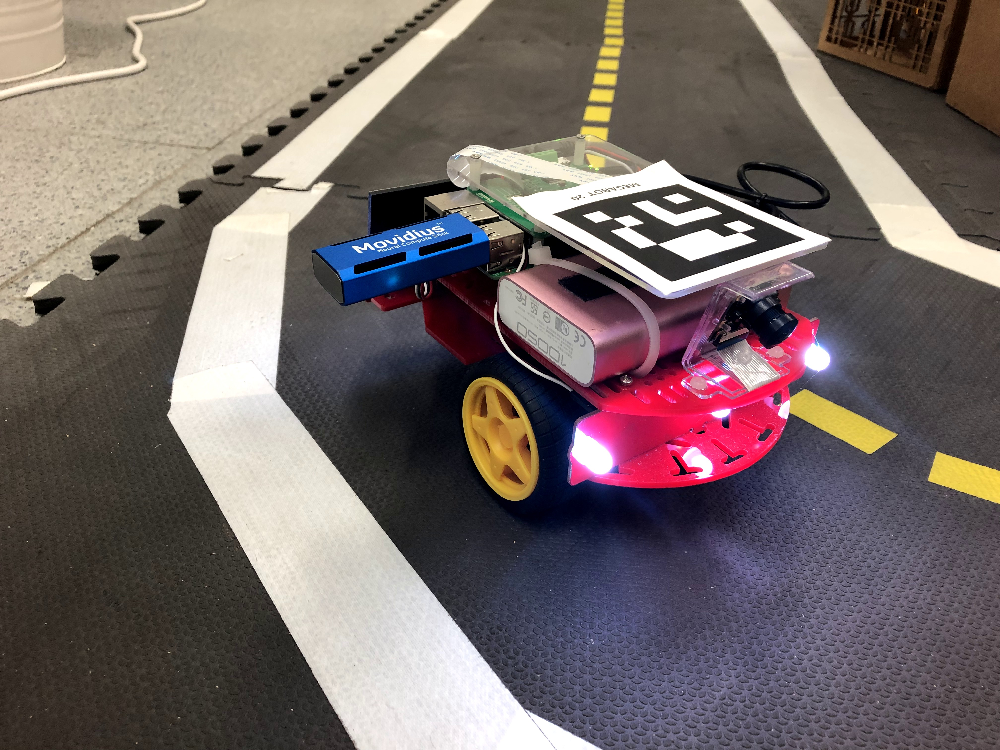

# ncs-lane-following-template

***

## How to build docker images for Ncs-lane-following
_In this tutorial we're going to build ncs-lane-following docker image for Raspberry Pi on x86 machine._

1. First, install cross-compiling tool for building arm image on x86 machine. `./qemu-arm-static` is provided for Ubuntu 18.04, but if this does not work, run 

```sh
git clone https://github.com/duckietown/ncs_lane_following_template && \
    cd rpi-ncsdk-docker && \
    sudo apt-get install qemu-user-static && \
    cp /usr/bin/qemu-arm-static .
```

2. To build new docker image, run this command bellow on your terminal

```sh
docker build -t [username]/ncs_lane_following .
```

3. Push the image to your own docker hub


```sh
docker push [username]/ncs_lane_following .
```

## How use this docker image
Plug in an NCS and run the following command on your duckiebot

```sh
docker run -it --name ncs_following --net host --privileged -v /dev:/dev -v /data:/data [username]/ncs_lane_following /bin/bash run_ncslanefollowingdemo.sh
```

## How to use your own caffemodel to do prediction on ncs in this template
Development Environment
```
1. ubuntu 16.04
2. NCSDK 1
```

1. First transfer caffemodel to ncs graph

```sh
mvNCCompile [xxx.prototxt] -w [xxx.caffemodel] -o [xxx.graph]
```

2. Move your graph file to ncs_following/models folder

3. Rename graph file to model.graph

## Image reference
This docker image is built from a github project called [ncs_lane_following](https://github.com/ARG-NCTU/ncs_lane_following) under ARG-NCTU, which is made by [Peter Hung](https://github.com/losttime1001)

<p align="center"></p>
